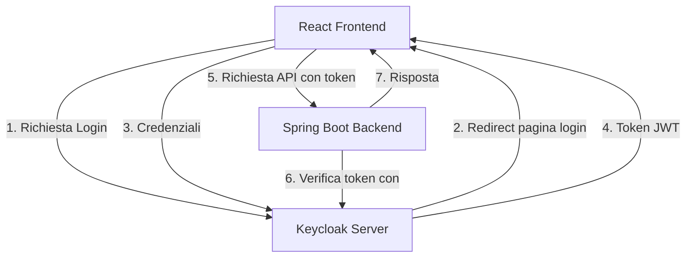

# Guida all'Autenticazione con React, Keycloak e Spring Boot

## Panoramica
Questa guida spiega in dettaglio come implementare l'autenticazione utilizzando React come frontend, Keycloak come server di autenticazione e Spring Boot come backend.

## Architettura del Sistema



## Componenti Principali

### 1. Keycloak Servera
- Gestisce l'autenticazione degli utenti
- Emette token JWT (JSON Web Tokens)
- Gestisce ruoli e permessi
- Supporta diversi protocolli (OpenID Connect, OAuth 2.0)

### 2. React Frontend
- Implementa il flusso di autenticazione OAuth2/OpenID Connect
- Gestisce i token (accesso e refresh)
- Mantiene lo stato di autenticazione
- Aggiunge automaticamente i token alle richieste API

### 3. Spring Boot Backend
- Verifica la validità dei token JWT
- Implementa la protezione delle API
- Gestisce le autorizzazioni basate sui ruoli
- Comunica con Keycloak per la validazione dei token

## Flusso di Autenticazione Dettagliato

1. **Inizializzazione**
   - L'utente accede all'applicazione React
   - React verifica se esiste una sessione valida

2. **Login**
   ```javascript
   // Configurazione in React (auth-config.js)
   export const authConfig = {
     realm: 'il-tuo-realm',
     clientId: 'react-client',
     url: 'http://localhost:8080/auth'
   };
   ```

3. **Gestione Token**
   - Keycloak emette token JWT dopo il login
   - Il frontend salva i token in modo sicuro
   - Implementa il refresh automatico dei token

4. **Protezione Backend**
   ```java
   // Configurazione Spring Security
   @Configuration
   @EnableWebSecurity
   public class SecurityConfig extends WebSecurityConfigurerAdapter {
       
       @Override
       protected void configure(HttpSecurity http) throws Exception {
           http
               .oauth2ResourceServer()
               .jwt();
           
           http.authorizeRequests()
               .antMatchers("/api/public/**").permitAll()
               .antMatchers("/api/private/**").authenticated();
       }
   }
   ```

## Implementazione Frontend

### AuthProvider (React)
```javascript
const AuthProvider = ({ children }) => {
    const [isAuthenticated, setIsAuthenticated] = useState(false);
    const [token, setToken] = useState(null);

    useEffect(() => {
        // Inizializzazione Keycloak
        initKeycloak();
    }, []);

    const login = async () => {
        // Redirect a Keycloak per login
        keycloak.login();
    };

    const logout = () => {
        // Logout e pulizia token
        keycloak.logout();
    };

    return (
        <AuthContext.Provider value={{ isAuthenticated, token, login, logout }}>
            {children}
        </AuthContext.Provider>
    );
};
```

## Implementazione Backend

### Configurazione Spring Boot (application.properties)
```properties
spring.security.oauth2.resourceserver.jwt.issuer-uri=http://localhost:8080/auth/realms/il-tuo-realm
spring.security.oauth2.resourceserver.jwt.jwk-set-uri=http://localhost:8080/auth/realms/il-tuo-realm/protocol/openid-connect/certs
```

### Controller Protetto
```java
@RestController
@RequestMapping("/api")
public class SecuredController {

    @GetMapping("/protected")
    @PreAuthorize("hasRole('user')")
    public ResponseEntity<String> getProtectedData() {
        return ResponseEntity.ok("Dati protetti");
    }
}
```

## Best Practices

1. **Sicurezza**
   - Utilizzare HTTPS in produzione
   - Implementare il refresh automatico dei token
   - Non salvare mai i token in localStorage
   - Utilizzare httpOnly cookies per i token

2. **Gestione Errori**
   - Implementare intercettori per errori 401/403
   - Gestire il refresh token automaticamente
   - Reindirizzare al login quando necessario

3. **Performance**
   - Implementare caching dei token
   - Ottimizzare le chiamate di verifica token
   - Utilizzare silent refresh quando possibile

## Troubleshooting Comuni

1. **Errori CORS**
   - Configurare correttamente le origini in Keycloak
   - Impostare header CORS nel backend Spring

2. **Token Invalidi**
   - Verificare la configurazione del realm
   - Controllare i tempi di scadenza dei token
   - Verificare la sincronizzazione dell'orologio dei server

3. **Problemi di Ruoli**
   - Controllare la mappatura dei ruoli in Keycloak
   - Verificare la configurazione dei client
   - Controllare i token JWT per i claim corretti

## Conclusione
L'integrazione tra React, Keycloak e Spring Boot fornisce un sistema di autenticazione robusto e sicuro. La chiave per una implementazione di successo è la corretta configurazione di tutti i componenti e una gestione appropriata del ciclo di vita dei token.