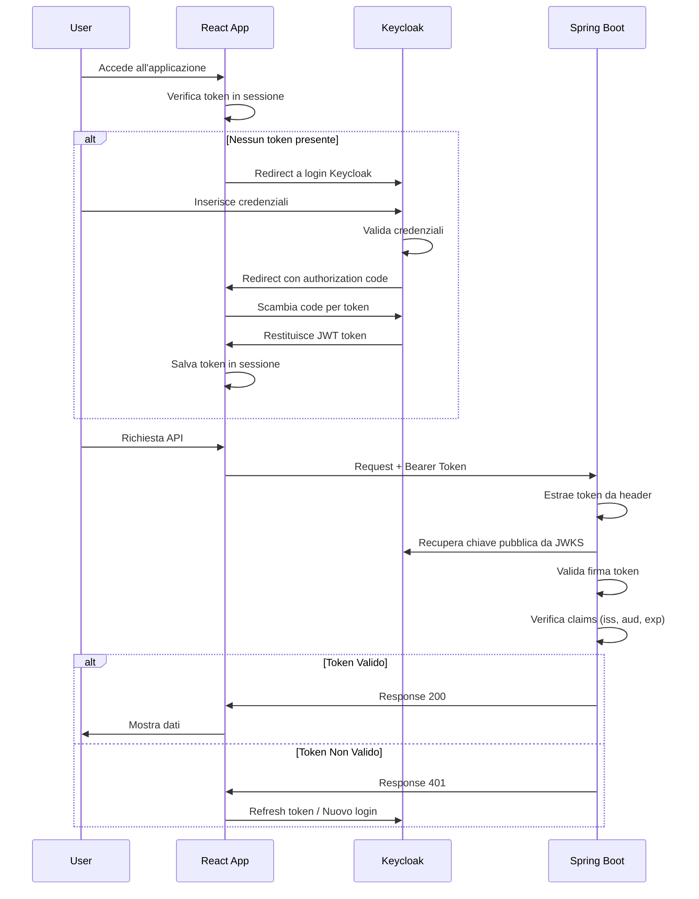

# Flusso di Autenticazione e Autorizzazione

Questo documento descrive il flusso completo di autenticazione e autorizzazione tra React, Keycloak e Spring Boot.

## Diagramma di Sequenza



## Componenti Principali

### 1. React Frontend

- Utilizza `oidc-client-ts` per la gestione del flusso OpenID Connect
- Configurazione in `auth-config.js`:
  ```javascript
  {
    authority: "http://localhost:8080/realms/TestRealm",
    client_id: "test-client",
    redirect_uri: "http://localhost:8081"
  }
  ```
- Gestisce automaticamente:
  - Redirect a Keycloak per login
  - Scambio del codice di autorizzazione per token
  - Memorizzazione sicura dei token
  - Refresh automatico dei token
  - Aggiunta del Bearer token alle richieste API

### 2. Keycloak Server

- Gestisce l'autenticazione degli utenti
- Emette token JWT firmati con chiave RSA
- Espone endpoints:
  - `/auth`: Autenticazione utente
  - `/token`: Scambio authorization code e refresh token
  - `/certs`: JWKS (JSON Web Key Set) per la verifica dei token
- Claims nel token JWT:
  ```json
  {
    "iss": "http://localhost:8080/realms/TestRealm",
    "sub": "user-id",
    "aud": "test-client",
    "exp": 1234567890,
    "iat": 1234567890
  }
  ```

### 3. Spring Boot Backend

- Implementa la validazione dei token JWT
- Componenti di sicurezza:
  1. `JwtAuthenticationFilter`:
     - Intercetta tutte le richieste
     - Estrae il token dall'header Authorization
     - Delega la validazione al JwtTokenValidator
  
  2. `JwtTokenValidator`:
     - Recupera la chiave pubblica da Keycloak JWKS
     - Verifica la firma del token
     - Valida i claims (issuer, audience, expiration)
  
  3. `SecurityConfig`:
     - Configura la catena di filtri di sicurezza
     - Definisce le regole di autorizzazione per gli endpoint

## Flusso Dettagliato

1. **Inizializzazione**
   - L'utente accede all'applicazione React
   - React verifica se esiste un token valido in sessione

2. **Autenticazione**
   - Se non c'è token, redirect a Keycloak
   - L'utente inserisce le credenziali
   - Keycloak autentica e genera authorization code
   - Redirect a React con il code
   - React scambia il code per token JWT

3. **Richieste API**
   - React include il token JWT nell'header Authorization
   - Spring Boot intercetta la richiesta
   - Recupera la chiave pubblica da Keycloak
   - Valida il token (firma + claims)
   - Se valido, processa la richiesta
   - Se non valido, ritorna 401

4. **Refresh Token**
   - Quando il token sta per scadere
   - React usa il refresh token per ottenere nuovo token
   - Se refresh fallisce, redirect a login

## Sicurezza

- **Token JWT**: Firmati con RSA (asimmetrico)
- **Chiavi**: Gestite da Keycloak, backend usa solo chiave pubblica
- **Validazione**: Verifica completa (firma, issuer, audience, scadenza)
- **Sessione**: Stateless, tutto contenuto nel token
- **CORS**: Configurato per permettere solo origini autorizzate

## Configurazione

### React (.env)
```properties
VITE_OIDC_ISSUER=http://localhost:8080/realms/TestRealm
VITE_OIDC_CLIENT_ID=test-client
VITE_OIDC_REDIRECT_URI=http://localhost:8081
```

### Spring Boot (application.properties)
```properties
keycloak.auth-server-url=http://localhost:8080
keycloak.realm=TestRealm
keycloak.resource=test-client